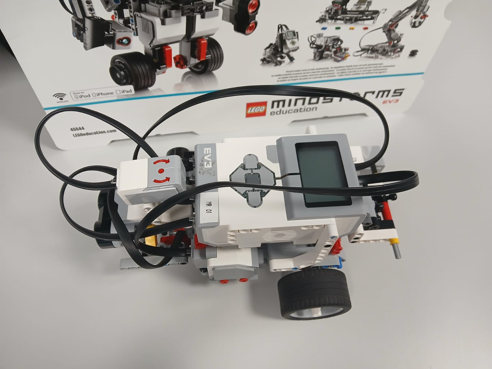
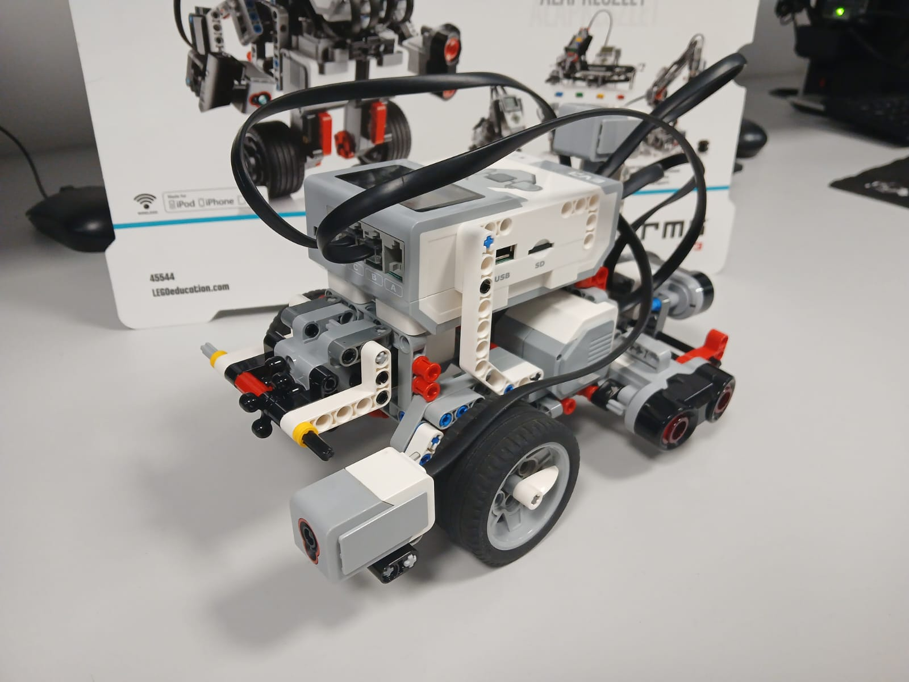
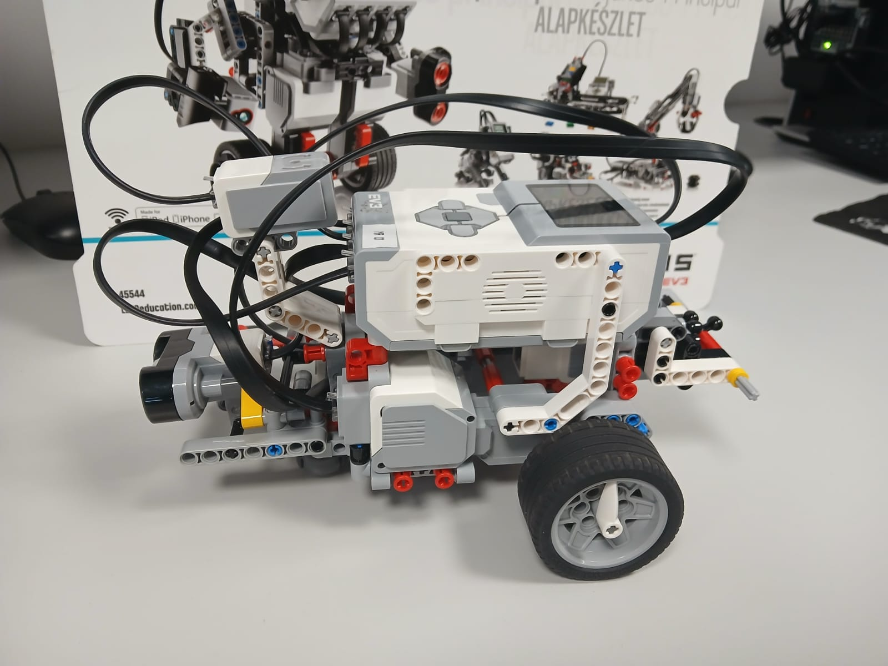
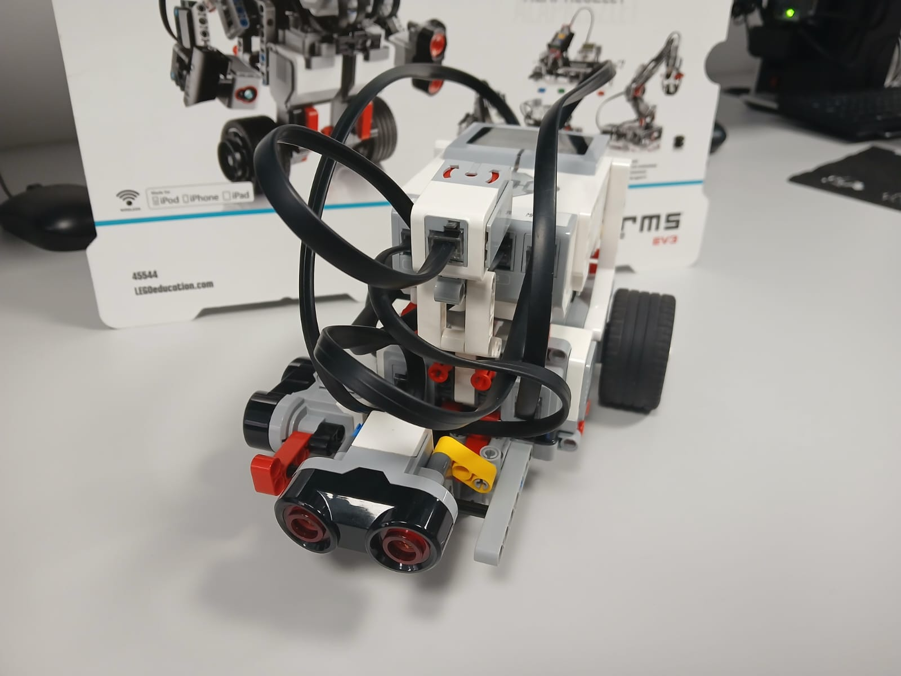

# Autonomous EV3 Parking Robot

.

## Overview
This project implements an autonomous parking assistant using a LEGO EV3 robot programmed in Python with the `ev3dev2` library. The robot is designed to navigate, detect parking spaces and perform parking maneuvers (perpendicular, parallel and angled), using onboard sensors and motors. It also includes a simple traffic light detection system using the color sensor.

## Robot Configuration
The EV3 robot includes the following hardware setup:

- **Drive Motors:** Large motors on ports B and C (connected to the wheels).

- **Ultrasonic Sensors:** One on the side (port 1) for space detection and one at the back (port 4) for parking distance measurement.

- **Gyro Sensor:** Port 2, used for accurate turning.

- **Color Sensor:** Port 3, detects traffic lights (red, yellow, green).

- **Button Interface:** Used to select parking type and control the flow of the program.

Dimensions and motor characteristics where obtained from official documentation and third-party sources:

- **Robot Size:** ~60 x 40 cm (Measured by hand).

- **Wheel Diameter:** 5.6 cm, giving a wheel circumference of ~17.6 cm ([Source](https://sites.google.com/site/gask3t/lego-ev3/the-missing-commentaries/ev3-beyond-basics-exercises-7-11)).

- **Max Motor RPM:** 170 RPM ([Source](https://www.oreilly.com/library/view/learning-lego-mindstorms/9781783985029/ch02s02.html)).

## Key Functional Modules

### 1. Motion Control and Gyro-Based Turning

- The `MoveTank` class is used to control the robot's wheels.

- Turning is managed via a gyroscopic sensor, which allows for more accurate angular rotations.

- The sensor is calibrated in the `__init__()` method.

- The `turn_degrees()` method turns based on the required angle.

 

### 2. Traffic Light Detection

- The robot uses its color sensor to identify traffic light colors:
	- Red (5): Stop
	- Yellow (4): Slow down
	- Green (3): Resume full speed

- Speed is adjusted based on the color detected, simulating real traffic rules.

### 3. Parking Mode Selection

- The user can choose between three parking styles via the EV3 buttons:
	- Left: Perpendicular
	- Right: Parallel
	- Up: Angled (45º)

### 4. Parking Space Detection

- While moving, the side ultrasonic sensor checks for open spaces.

- If a sufficiently long opening is detected, the robot calculates the width of the space using:

		width = duration * speed (in cm/s)
	
	- Speed estimation is based on wheel size and motor power level.
	
	- At 20% motor power, the estimated speed is ~9.97 cm/s:

			170 RPM * 17.6 cm = ~2992 cm/min = ~49.9 cm/s
			20% power -> 49.9 * 0.20 = ~9.97 cm/s

### 5. Parking Execution

- **Perpendicular:** The robot reverses straight, turns 90º and aligns using rear ultrasonic.

- **Parallel:** Includes a 45º turn, reverse, then straighten and forward alignment.

- **Angled:** A combination of slight forward movement and reverse turning at 45º.

### 6. Reverse Parking and Final Adjustments

- While reversing, the robot uses the back ultrasonic sensor to stop ~6 cm before the wall.

- Some fine-tuning logic is included (commented out) for future enhancement.

## Conclusion
This EV3 parking system integrates real-world autonomous vehicle principles into a LEGO robot. It successfully identifies different parking types, navigates based on sensor input and follows basic traffic rules. Through careful sensor integration and motor control, the robot approximates realistic car maneuvers within the constraints of LEGO hardware.

